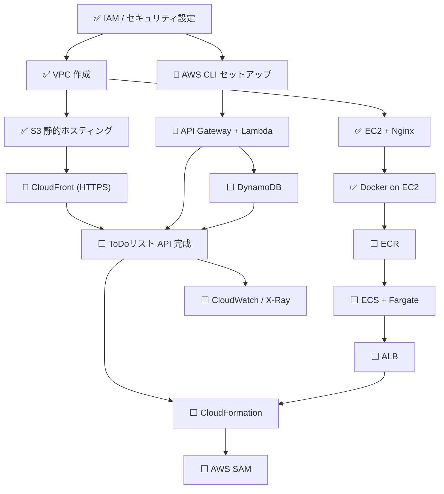
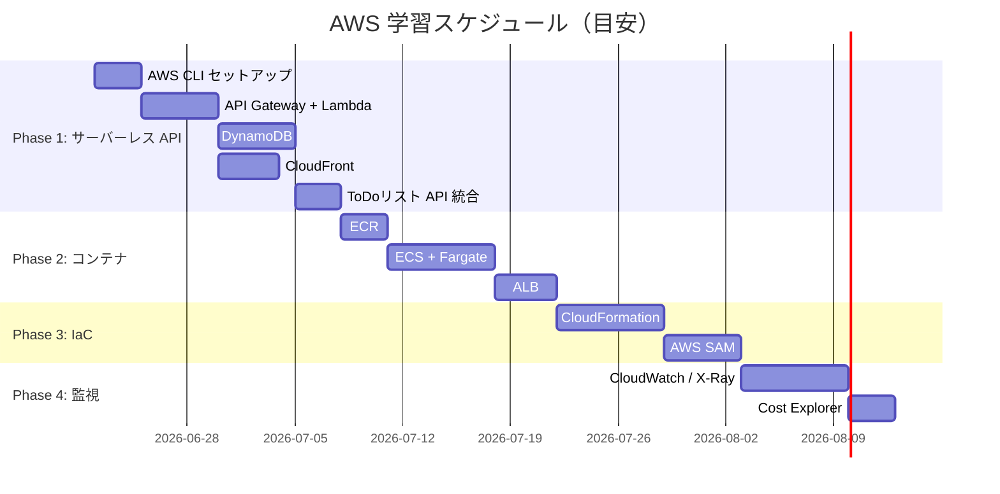

# AWS 学習ロードマップ

## 全体フロー

> 凡例: ✅ 完了 / 🔄 学習中 / ⬜ 未着手

---

## フェーズ別スケジュール

---

## 前提スキルの依存関係

| 学ぶトピック | 必要な前提知識 |
|-------------|---------------|
| API Gateway + Lambda | Lambda 基本 ✅ |
| DynamoDB | Lambda + API Gateway |
| CloudFront | S3 静的ホスティング ✅ |
| ECR | Docker on EC2 ✅ |
| ECS + Fargate | ECR, VPC ✅ |
| CloudFormation | 各サービスの手動操作経験 |
| AWS SAM | Lambda, API Gateway, CloudFormation |
| CloudWatch | Lambda or EC2 ✅ |
| X-Ray | Lambda + API Gateway |

---

## マイルストーン

| マイルストーン | 達成条件 |
|---------------|---------|
| 🏆 サーバーレス入門 | ToDoリスト API (API GW + Lambda + DynamoDB) が動作する |
| 🏆 コンテナ運用 | Fargate + ALB でコンテナが HTTPS 公開される |
| 🏆 IaC 入門 | CloudFormation で構成を再現できる |
| 🏆 AWS 実践レベル | 監視・コスト管理まで含めた運用ができる |
